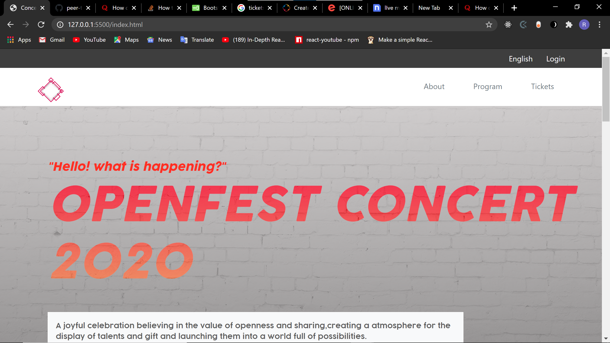

# html-capstone-project
Give a ⭐️ if you like this project!  

# HTML/CSS Capstone Project : OPENFEST CONCERT PAGE

 _OpenFest is a concert organized annually with several special appearances._

## 📺 Live Demo 

[OPENFEST](https://rayking12.github.io/html-capstone-project/)

## 📡 Technologies used :

- HTML & CSS
- Bootstrap 4 ~ _For positioning pages elements_
- Flexbox & Media queries ~ _Some elements visibilty control_
- SASS ~ _Organizing CSS file_

## 🛠 Tools used :

1. [VSCode](https://code.visualstudio.com/) - _As a code editor_
1. [Webhint](https://webhint.io/) & [Stylelint](https://stylelint.io/) - _Code testing_
1. [Google DevTools](https://developers.google.com/) - _Debugging tool_

## Getting Started

Follow these steps to get a local copy up and running :

1. Install `git` on your local machine
1. Type `git init` in the Terminal
1. Clone the repository to your local machine `https://github.com/od-c0d3r/highmount.git`
1. Cd into the repository `cd conference-page`
1. Open the `index.html` file and run it with any browser of your choice

## 👤 Auther Ray King

- 
- 

## Show your support

Give a ⭐️ if you like this project!

## Acknowledgments

- Design idea by [Cindy Shin in Behance](https://www.behance.net/adagio07)

## 📝 License

This project is [MIT](lic.url) licensed.